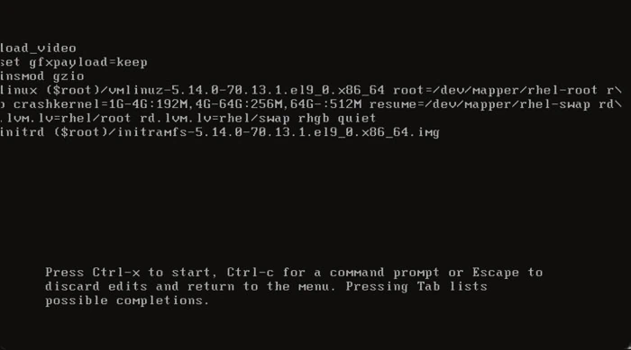

`rd.break` is a kernel argument to interrupts the boot process and to gain access to a minimal shell before the root filesystem is mounted. This is incredibly useful when faced with problems like forgotten root passwords, misconfigured filesystems, or even hardware-related issues.

This method requires **no password** to work.

**Warning!** Always make sure to back up your data before making changes to your system. This forum post is for informational purposes only, and I’m not responsible for any consequences arising from its use.

## How To Use `rd.break`?

1. Start by rebooting the system.
2. During the boot process, when the GRUB menu appears (or the bootloader you’re using), select your desired kernel entry.
3. Press "e" to edit the kernel parameters.

4. Navigate to the line that starts with `linux` or `linuxefi`.
5. Add `rd.break` at the end of that line.
6. Replace the `ro` argument with `rw`, if it exists. Otherwise, you won't be able to modify the system.
7. Remove `rhgb` and `quiet`, if they exist. Otherwise, boot messages will be hidden.
8. Press `Ctrl+x` to boot with the modified parameters.

## What Can You Do in the Minimal Shell?

Once the minimal shell (initramfs) is loaded, you have a chance to:
- Remount the root filesystem in read-write mode using `mount -o remount,rw /sysroot`.
- Access the `/sysroot` directory, which contains the root filesystem.
- Make changes, repair configurations, or reset passwords.

### Example Scenario: Resetting the Root Password

One common use case is resetting a forgotten root password. Here’s how:
1. Use `chroot /sysroot` to switch to the root filesystem.
2. Use `passwd` to change the root password.
3. Exit the chroot environment and reboot.

## Configuring SELinux

**Warning!** This is a crucial step for distributions based on Red Hat like Fedora or Rocky Linux. For other popular distributions, you can likely **skip this step**.

If your distribution uses SELinux and you have changed the password, the context type in `/etc/shadow` is now messed up, which will deny further logins once the system is fully booted. Here are to ways to fix this:

- `touch /.autorelabel`, which will force SELinux to restore labels that are set on the entire file system.

**Note**: The next boot might take longer, since restoring all the labels is time consuming.
